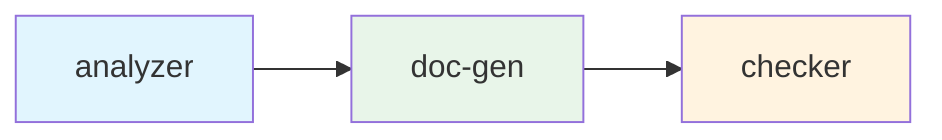

# Compose Orchestration

Define multi-agent DAG workflows in YAML. The Compose engine handles dependency resolution, parallel scheduling, result passing, token budget pools, and SLA contracts.

---

## Quick Start

```yaml
# compose.yaml
version: "1.0"
intent: "Code review workflow"
model: "haiku"

agents:
  analyzer:
    intent: "Analyze code quality of kernel/kernel.go"
    agent: "code-analyst"
  doc-gen:
    intent: "Generate improvement documentation"
    depends_on:
      analyzer: completed
  checker:
    intent: "Verify analysis quality"
    depends_on:
      doc-gen: completed
```

```bash
$ rnix compose up
compose | Code review workflow | starting
[layer 1/3] analyzer   PID 5 | completed | 3.8s | 1,450 tokens ✓
[layer 2/3] doc-gen    PID 6 | completed | 4.2s | 1,180 tokens ✓
[layer 3/3] checker    PID 7 | completed | 2.5s | 890 tokens ✓
compose | completed | 3/3 agents | 10.5s | 3,520 tokens
```

---

## DAG Scheduling

The engine automatically:

1. **Parses dependency graph** — builds DAG from `depends_on`
2. **Topological sort** — determines execution layers
3. **Parallel execution** — agents in the same layer run concurrently
4. **Result injection** — upstream output injected into downstream context

```
analyzer ──→ doc-gen ──→ checker      # Linear
    A ←─ C ─→ B                       # C blocks both; A, B parallel after C
```



---

## Agent Fields

| Field | Type | Description |
|-------|------|-------------|
| `intent` | string | Task description |
| `agent` | string | Named agent definition (optional) |
| `model` | string | Model override |
| `provider` | string | Provider override |
| `depends_on` | map | `<upstream>: completed` |
| `timeout` | duration | Execution timeout |
| `max_retries` | int | Retry on failure |
| `budget` | int | Token budget (drawn from pool) |
| `priority` | string | `high` / `normal` / `low` |

---

## Token Budget Pools

Assign a shared token budget across the workflow:

```yaml
budget_pool:
  total: 50000
  allocation: priority    # priority | equal | proportional

agents:
  critical-agent:
    budget: 20000
    priority: high
  helper-agent:
    budget: 5000
    priority: low
```

When agents compete for limited budget, high-priority agents get preference. See [Token Economy](/guide/token-economy).

---

## SLA Contracts

Define quality expectations between agents:

```yaml
agents:
  analyzer:
    intent: "Analyze code"
    contract:
      output_quality: "Must contain at least 3 actionable items"
      max_tokens: 3000
      timeout: 30s
      sla_level: gold
```

Post-execution SLA evaluation feeds into the [Reputation System](/guide/token-economy).

---

## Result Injection

Upstream agent output is automatically injected into downstream agent context. When agent B depends on agent A, A's final result is prepended to B's system prompt as a tool message:

```
[Upstream Result from analyzer]
---
<analyzer's output here>
---
```

This allows downstream agents to build on upstream results without explicit plumbing.

## Error Handling

| Scenario | Behavior |
|----------|----------|
| Agent fails (exit code 1) | Downstream agents are cancelled, workflow marked as failed |
| Agent timeout | Configured `timeout` exceeded → agent killed with SIGTERM |
| Agent exceeds budget | Exit code 2, treated same as failure |
| All retries exhausted | Agent marked permanently failed, downstream cancelled |

Set `max_retries` to automatically retry failed agents:

```yaml
agents:
  flaky-analyzer:
    intent: "Analyze code"
    max_retries: 3    # retry up to 3 times on failure
```

## Compose File Reference

| Field | Type | Default | Description |
|-------|------|---------|-------------|
| `version` | string | — | Compose spec version (`"1.0"`) |
| `intent` | string | — | Workflow description (shown in CLI output) |
| `model` | string | — | Default model for all agents |
| `budget_pool` | object | — | Shared token budget configuration |
| `agents` | map | — | Agent definitions (key = agent name) |

### Budget Pool Fields

| Field | Type | Default | Description |
|-------|------|---------|-------------|
| `total` | int | — | Total token budget across all agents |
| `allocation` | string | `priority` | Allocation strategy: `priority`, `equal`, or `proportional` |

---

## Commands

```bash
rnix compose up              # Start workflow
rnix compose up --json       # JSON output
rnix compose down            # Stop all agents and cleanup
```

---

## Related Documentation

- [AgentShell](/guide/agentshell) — Scripting-based orchestration
- [Intent System](/guide/intent-system) — Declarative intent decomposition
- [Token Economy](/guide/token-economy) — Budget pools and reputation
- [Monitoring](/guide/monitoring) — rnix top for real-time process view
