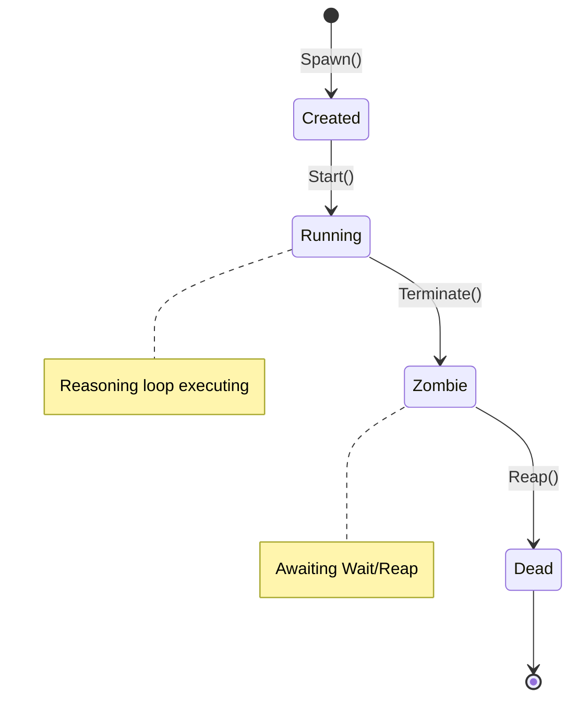

# Rnix Core Concepts

Rnix is an operating system designed for AI agents (Agent OS). It draws on the core design philosophy of Unix — processes, filesystems, system calls — to provide a unified runtime environment for AI agents. In Rnix, every agent execution is a process, every external resource (LLM, filesystem, shell) is a file, and every interaction with the kernel is a system call. This document helps you build the core mental model of Rnix.

---

## 1. Process

### Definition

A process is the first-class computing unit in Rnix. When you execute the `rnix -i "intent"` command, the Rnix kernel creates an agent process to fulfill your intent. Each process has its own independent PID, context space, file descriptor table, and debug channel.

Rnix uses a daemon architecture for process management: a single background daemon holds the sole kernel instance and process table, and all CLI commands communicate with the daemon over a Unix domain socket. The daemon starts automatically on first `rnix` invocation and exits automatically after 60 seconds of idle time. You can also check daemon status with `rnix daemon status` or manually stop it with `rnix daemon stop`. This design makes processes visible at the system level — a process started in terminal A can be viewed and operated on in terminal B via `rnix ps`/`rnix kill`/`rnix strace`, consistent with Unix process behavior.

### Unix Analogy

| Rnix Concept | Unix Equivalent | Description |
|-------------|----------------|-------------|
| Process | Unix process | Runtime instance of a single agent execution |
| PID | Process ID | Globally unique, incrementally assigned, never recycled |
| State machine | Process states | Created → Running → Zombie → Dead |
| Spawn | fork + exec | Create and start a new process |
| Kill | kill(2) signal | Send termination signal (SIGTERM/SIGKILL) |
| Wait | waitpid(2) | Wait for process to finish and reclaim resources |

### Process Lifecycle

A process transitions strictly through the following state machine from creation to destruction:

```
Created ──→ Running ──→ Zombie ──→ Dead
   │           │           │
   │  Start()  │ Terminate │  Reap()
   │  Begin    │ Complete/ │  Wait reclaim
   │  reasoning│ Error/    │  Resource
   │           │ Timeout/  │  release
   │           │ Kill      │
```



**State descriptions:**

- **Created** — Process object allocated, but reasoning loop has not started
- **Running** — Reasoning loop is executing, agent is thinking and using tools. A running process can be paused via SIGPAUSE — the reasoning loop blocks until SIGRESUME, but the process remains in Running state.
- **Zombie** — Reasoning has ended (completed normally, errored, timed out, or killed), waiting for parent process to call Wait for reclamation
- **Dead** — All resources released, process removed from process table

State transitions are strictly one-directional; rollback is not allowed (e.g., cannot go from Zombie back to Running).

### Example: Complete Process Lifecycle

```bash
$ rnix -i "Analyze code"
```

This command triggers the following lifecycle:

1. **Spawn** — Kernel creates process (PID 1), allocates context space, opens LLM device, state is Created
2. **Start** — Reasoning goroutine launches, process transitions to Running
3. **ReasonStep loop** — Agent converses with LLM, may invoke filesystem or shell tools
4. **Complete** — Agent produces final result, process transitions to Zombie, exit status written to Done channel
5. **Wait/Reap** — CLI layer reads Done channel, triggers resource release sequence, process transitions to Dead

CLI output example:

```
[kernel] spawning PID 1 (claude/haiku)...
[agent]  step 1/10
[result] Code analysis results...
[kernel] PID 1 exited(0) | claude/haiku | tokens: 1234 | elapsed: 6.2s
```

### Process Tree

Each process records its parent-child relationship through PPID (Parent Process ID):

- Processes spawned directly by CLI have PPID 0 (top-level processes)
- Child processes record the parent's PID as their PPID at spawn time
- When a parent process exits, its surviving children are **reparented** to PID 0, rather than being terminated — consistent with Unix where orphan processes are adopted by the init process

### Key Process Properties

| Property | Description |
|----------|-------------|
| PID | Globally unique process identifier (monotonically increasing, never recycled) |
| UUID | UUID v7 identifier — globally unique across daemon restarts, provides time-ordered uniqueness |
| PPID | Parent process PID |
| Intent | User intent string, immutable after creation |
| State | Current state (Created/Running/Zombie/Dead) |
| IsPaused | Whether the process is paused (SIGPAUSE active, reasoning loop blocked) |
| PausedAt | Timestamp when pause started; zero when not paused |
| Skills | List of skill names owned by the process |
| CtxID | Associated context space identifier |
| FDTable | Process's open file descriptor table |
| AllowedDevices | Device permission whitelist (aggregated from Skills) |
| DebugChan | Debug event channel (buffer 256), consumed by strace |
| TokensUsed | Cumulative token consumption |
| Provider | Resolved LLM provider name (immutable after spawn) |
| Model | Resolved model name (immutable after spawn) |

### Process Identification: PID and UUID

Each process has two identifiers:

- **PID** — A monotonically increasing integer, unique within a single daemon session. PIDs are never recycled.
- **UUID** (UUID v7) — A globally unique identifier that persists across daemon restarts. UUID v7 embeds a timestamp, providing natural time-ordering. Step records and trace data are stored using UUID for cross-session continuity.

In most CLI commands, PID is used for referencing processes. UUID is used internally for data persistence and in Dashboard history views.

### Process History

When a process exits, it is recorded in a bounded FIFO history buffer. This allows the system to retain information about recently completed processes for:

- Dashboard history view browsing
- Step record retrieval
- Debugging and analysis

The history buffer has a configurable size limit; oldest entries are evicted when the buffer is full.

---

## 2. Virtual File System (VFS)

### Definition

VFS is Rnix's unified abstraction layer. All external resources — LLM inference engines, host filesystem, shell command execution, process runtime status — are accessed through unified file paths. Rnix follows the Unix "everything is a file" philosophy: you Open a device path to get a file descriptor (FD), interact with the device through Read/Write, and finally Close to release resources.

### Unix Analogy

| Rnix Concept | Unix Equivalent | Description |
|-------------|----------------|-------------|
| VFS | Virtual file system | Unified resource access abstraction layer |
| `/dev/` | Device files | LLM, filesystem, shell, and other devices |
| `/proc/` | procfs | Dynamically generated process runtime information |
| FD (File Descriptor) | File descriptor | Per-process incrementing integer, allocated from 3 (0/1/2 reserved) |
| DeviceRegistry | Device driver registration | Maps VFS paths to device factories |

### Device Path Table

The following are all registered VFS device paths in Rnix:

| VFS Path | Purpose | Driver Implementation |
|---------|---------|----------------------|
| `/dev/llm/claude` | LLM inference device | Via Claude Code CLI (`claude -p`) |
| `/dev/llm/cursor` | LLM inference device | Via Cursor CLI (`agent --print`) |
| `/dev/llm/<provider>` | LLM inference device | OpenAI-compatible HTTP API (Ollama, Groq, DeepSeek, etc.) |
| `/dev/fs` | Host filesystem access | Wraps Go stdlib `os.Open/Read` |
| `/dev/shell` | Shell command execution | Wraps `exec.CommandContext` |
| `/proc/{pid}/status` | Process status (JSON) | ProcFS dynamically generated |
| `/proc/{pid}/intent` | Process intent (plain text) | ProcFS dynamically generated |
| `/proc/{pid}/context` | Process context summary | ProcFS dynamically generated |

### Example: VFS Operation Chain During Reasoning

When an agent performs reasoning, the complete VFS operation sequence is as follows (steps 1 and 8 are process-level operations; steps 2-7 belong to a single reasoning step):

```
1. Open("/dev/llm/claude", O_RDWR)     → FD(3)        Open LLM device
2. Write(FD(3), <request JSON>)         → ok           Send inference request to LLM
3. Read(FD(3), 65536)                   → <response>   Read LLM response
4. Open("/dev/fs/./src/main.go", O_RDWR) → FD(4)       Agent requests file read (tool call)
5. Write(FD(4), <read request>)          → ok           Write read parameters
6. Read(FD(4), 65536)                   → <file content> Get file content
7. Close(FD(4))                         → ok           Close file device
8. Close(FD(3))                         → ok           Close LLM device
```

### DeviceRegistry: Device Discovery and Prefix Matching

The DeviceRegistry maps VFS paths to corresponding device drivers. It supports two matching modes:

1. **Exact match** — Path exactly matches registered path (e.g., `/dev/shell`)
2. **Longest prefix match** — Path starts with registered path (e.g., `/dev/fs/path/to/file` matches `/dev/fs`, with remaining `/path/to/file` passed as subpath to the driver)

All device drivers implement the unified `VFSFile` interface:

```
VFSFile Interface:
  Read(length)      — Read data from device
  Write(ctx, data)  — Write data to device (supports context cancellation)
  Close()           — Close device, release resources
  Stat()            — Get device metadata
```

Device registration is completed via dependency injection when the daemon starts — the daemon process initializes the kernel, VFS, and all drivers, registering them with the DeviceRegistry. CLI commands act as clients communicating with the daemon via IPC, never directly touching the kernel or devices.

---

## 3. Agent and Skill

### Agent: Who I Am

An Agent defines the identity and role of an intelligent agent. It answers the question "Who am I" — including name, description, model preferences, context budget, and which Skills it references.

An Agent's configuration is in `agent.yaml`, paired with `instructions.md` for role instructions. Agents are stored in `~/.config/rnix/agents/` (global) or `.rnix/agents/` (project):

```
agents/code-analyst/
├── agent.yaml        # Agent config (identity, model preferences, skill references)
└── instructions.md   # Agent role definition (system prompt)
```

Using `code-analyst` as an example, its `agent.yaml`:

```yaml
name: code-analyst
description: "Agent that analyzes code quality, identifies issues, and provides improvement suggestions"
models:
  provider: claude    # or cursor (optional, overridable via --provider CLI flag)
  preferred: sonnet
  fallback: haiku
context_budget: 8192
skills:
  - code-analysis
```

### Skill: How to Do X

A Skill defines a specific piece of procedural knowledge — it answers the question "How to do X". Skills follow the Agent Skills industry standard, represented as `SKILL.md` files containing YAML frontmatter (metadata + tool permissions) and a Markdown body (operational guide). Skills are stored in `~/.config/rnix/skills/` (global) or `.rnix/skills/` (project):

```
skills/code-analysis/
└── SKILL.md          # Skill definition (Agent Skills standard format)
```

Using `code-analysis` as an example, its `SKILL.md` frontmatter:

```yaml
name: code-analysis
description: >
  Analyze code quality, identify bugs, performance issues and security
  vulnerabilities.
allowed-tools: /dev/fs /dev/shell
```

The `allowed-tools` field defines which VFS device paths this Skill can access — this is the core of Rnix's permission model.

### Unix Analogy

| Rnix Concept | Unix Equivalent | Description |
|-------------|----------------|-------------|
| Agent | Executable program (/usr/bin/xxx) | Defines "who I am" — role, model preferences |
| Skill | Shared library (.so/.dylib) | Defines "how to do X" — procedural knowledge, tool permissions |
| Process | Runtime process instance | Runtime manifestation of Agent + Skill combination |

Just as a Unix executable links multiple shared libraries, an Agent can reference multiple Skills.

### Four-Layer Capability Model

```
┌──────────────────────────────────────┐
│      Process (Runtime Instance)      │
│  PID, State, FDTable, DebugChan...   │
├──────────────────────────────────────┤
│         Agent (Who I Am)             │
│  name, models, context_budget        │
│  instructions.md → System prompt     │
├──────────────────────────────────────┤
│     Skill A          Skill B         │
│  "How to analyze    "How to write    │
│   code"              tests"          │
│  allowed-tools:    allowed-tools:    │
│  /dev/fs           /dev/fs           │
│  /dev/shell        /dev/shell        │
├──────────────────────────────────────┤
│      VFS Device Layer (Capabilities) │
│  /dev/fs  /dev/shell  /dev/llm/...   │
└──────────────────────────────────────┘
```

Processing flow during Spawn:

1. CLI `--agent=code-analyst` → AgentLoader loads `agent.yaml` + `instructions.md`
2. AgentLoader parses `skills` list → SkillLoader loads each `SKILL.md`
3. `AllowedTools()` aggregates all Skills' `allowed-tools` → sets process's AllowedDevices whitelist
4. `SystemPrompt()` = Agent instructions + Skill bodies concatenated → used as LLM system prompt

### Agent vs Skill Separation of Concerns

| Dimension | Agent | Skill |
|-----------|-------|-------|
| Definition | "Who I am" — identity and role | "How to do X" — procedural knowledge |
| Model preferences | Yes (provider/preferred/fallback) | No |
| Context budget | Yes (context_budget) | No |
| Device permissions | No (determined by Skill aggregation) | Yes (allowed-tools) |
| Reusability | Specific role | Shared across Agents |

### Progressive Loading Strategy

Rnix uses progressive loading for Skills to optimize resource consumption:

1. **Discovery phase** — reads only the YAML frontmatter of SKILL.md (~100 tokens), obtaining name, description, and tool permissions
2. **Activation phase** — loads the full SKILL.md body (< 5000 tokens), including operational guides, workflows, etc.
3. **Execution phase** — loads associated scripts and resource files on demand

---

## 4. System Calls (Syscall)

### Definition

System calls (syscalls) are the sole interface for agents to interact with the kernel. Just as Unix processes request kernel services like file I/O and process management through syscalls, agents in Rnix use syscalls to access VFS devices, manage child processes, and manipulate context space.

### Unix Analogy

| Rnix Syscall | Unix Equivalent | Description |
|-------------|----------------|-------------|
| Spawn | fork + exec | Create and start new process |
| Kill | kill(2) | Send signal to terminate process |
| Wait | waitpid(2) | Wait for process to finish and reclaim resources |
| Open | open(2) | Open device path, get file descriptor |
| Read | read(2) | Read data from file descriptor |
| Write | write(2) | Write data to file descriptor |
| Close | close(2) | Close file descriptor |
| Stat | stat(2) | Get path metadata |
| CtxAlloc | mmap/brk | Allocate context space |
| CtxRead | Memory read | Read context content |
| CtxWrite | Memory write | Write context content |
| CtxFree | munmap | Free context space |

### MVP Syscall Classification Table

Rnix's kernel interface is composed of multiple sub-interfaces, defining 45 syscalls total across process management, context, VFS, IPC, signal, capability, supervisor, and debugging:

**Process Management (ProcessManager) — 5**

| Syscall | Signature Summary | Description |
|---------|-------------------|-------------|
| Spawn | `Spawn(intent, agent, opts) → PID` | Create and start agent process |
| Kill | `Kill(pid, signal) → error` | Send termination signal to process |
| Wait | `Wait(pid) → ExitStatus` | Wait for process to finish, reclaim resources |
| GetPID | `Process.GetPID() → PID` | Get current process PID |
| PS | `ListProcs() → []ProcInfo` | List all process snapshots |

**Context Management (ContextManager) — 4**

| Syscall | Signature Summary | Description |
|---------|-------------------|-------------|
| CtxAlloc | `CtxAlloc(size) → CtxID` | Allocate new context space |
| CtxRead | `CtxRead(cid, offset, length) → []byte` | Read context content |
| CtxWrite | `CtxWrite(cid, offset, data) → error` | Write context content |
| CtxFree | `CtxFree(cid) → error` | Free context space |

**File System (FileSystem) — 5**

| Syscall | Signature Summary | Description |
|---------|-------------------|-------------|
| Open | `Open(pid, path, flags) → FD` | Open device path, allocate file descriptor |
| Read | `Read(pid, fd, length) → []byte` | Read from file descriptor |
| Write | `Write(ctx, pid, fd, data) → error` | Write to file descriptor |
| Close | `Close(pid, fd) → error` | Close file descriptor |
| Stat | `Stat(path) → FileStat` | Query path metadata |

**Debugging (Debugger) — 1**

| Syscall | Description |
|---------|-------------|
| DebugRecord | All syscall entry/exit automatically recorded as SyscallEvent to DebugChan (automatic mechanism, not explicit call) |

### Example: Complete Syscall Sequence in a Process Lifecycle

Using `rnix -i "Analyze code" --agent=code-analyst` as an example, the complete syscall sequence from process creation to destruction:

```
[  0.000s] Spawn("Analyze code", agent="code-analyst")    = PID(1)       12ms
[  0.012s] CtxAlloc(64)                                    = CtxID(1)      0ms
[  0.013s] Open("/dev/llm/claude", O_RDWR)                 = FD(3)         1ms
[  0.014s] Write(FD(3), <prompt>)                          = ok           5200ms  ← LLM call
[  5.214s] Read(FD(3), 65536)                              = <response>     2ms
[  5.216s] Open("/dev/fs/./src/main.go", O_RDWR)           = FD(4)         1ms    ← Tool call
[  5.217s] Write(FD(4), <tool data>)                       = ok             0ms
[  5.217s] Read(FD(4), 65536)                              = <file content> 1ms
[  5.218s] Close(FD(4))                                    = ok             0ms
[  5.218s] CtxWrite(CtxID(1), 0, <tool result>)            = ok             0ms
[  5.219s] Write(FD(3), <prompt+context>)                  = ok           3100ms  ← Second reasoning round
[  8.319s] Read(FD(3), 65536)                              = <final text>   2ms
[  8.321s] Close(FD(3))                                    = ok             0ms
[  8.321s] CtxFree(CtxID(1))                               = ok             0ms
```

### SyscallError Error Model

Each syscall returns a structured `SyscallError` on failure, containing complete diagnostic information:

| Field | Description | Example |
|-------|-------------|---------|
| Syscall | Name of the failed syscall | `"Spawn"`, `"Open"`, `"CtxWrite"` |
| PID | PID of the process that initiated the syscall | `1` |
| Device | VFS path involved | `"/dev/llm/claude"` |
| Err | Underlying error | `"context deadline exceeded"` |
| Code | Classification error code | `TIMEOUT`, `NOT_FOUND`, `PERMISSION`, `INTERNAL`, `DRIVER`, `INVALID` |

Formatted output: `[TIMEOUT] PID 1 Spawn: /dev/llm/claude (context deadline exceeded)`

### SyscallEvent Debug Tracing

All syscall entries and exits are automatically recorded as `SyscallEvent`s, delivered via the process's DebugChan (buffer 256). When the buffer is full, new events are silently dropped without blocking syscall execution.

Each SyscallEvent contains:

| Field | Description |
|-------|-------------|
| Timestamp | Offset relative to process creation time |
| PID | Process identifier |
| Syscall | Syscall name (matches interface method name) |
| Args | Call arguments (key-value pairs) |
| Result | Return value |
| Err | Error information |
| Duration | Syscall execution time |

Use `rnix strace <pid>` to consume these events in real-time, similar to Unix `strace`:

```bash
$ rnix strace 1
[strace] attached to PID 1 (state: running)
[  0.013s] Open("/dev/llm/claude", O_RDWR)  = FD(3)    1ms
[  0.014s] Write(FD(3), 1234 bytes)          = ok      5200ms
[  5.214s] Read(FD(3), 65536)                = 892B      2ms
...
[strace] detached from PID 1 (process exited)
```

---

## 5. Concept Relationships Overview

### Call Chain Architecture Diagram

```
User / CLI (Client Mode)
    │
    │  Unix Domain Socket (IPC)
    ▼
┌──────────────────────────────────────────┐
│        Daemon (Background Process)       │
│                                          │
│  ┌────────────────────────────────────┐  │
│  │          IPC Server                │  │
│  │  Receive request → Route → Stream  │  │
│  └───────────────┬────────────────────┘  │
│                  │                       │
│  ┌───────────────▼────────────────────┐  │
│  │          Kernel                    │  │
│  │  ProcessManager + ContextManager   │  │
│  │  + FileSystem + Debugger           │  │
│  │                                    │  │
│  │  ┌─────────┐    ┌──────────────┐   │  │
│  │  │ Process  │───→│ reasonStep() │   │  │
│  │  │ Table    │    │ Reasoning    │   │  │
│  │  └─────────┘    └──────┬───────┘   │  │
│  │                        │ Syscall   │  │
│  │                        ▼           │  │
│  │  ┌────────────────────────────┐    │  │
│  │  │     VFS (Virtual FS)       │    │  │
│  │  │  Open / Read / Write / Close│   │  │
│  │  └─────────────┬──────────────┘    │  │
│  │                │ DeviceRegistry    │  │
│  │                ▼                   │  │
│  │  ┌──────┬──────┬───────┬───────┐   │  │
│  │  │/dev/ │/dev/ │/dev/  │/proc/ │   │  │
│  │  │llm/  │fs    │shell  │{pid}/ │   │  │
│  │  │claude│      │       │status │   │  │
│  │  └──┬───┴──┬───┴───┬───┴───┬───┘   │  │
│  └─────┼──────┼───────┼───────┼───────┘  │
└────────┼──────┼───────┼───────┼──────────┘
         ▼      ▼       ▼       ▼
      Claude   Host    Shell   Process
      Code     File    Command Runtime
      CLI      System  Exec    Status
```

The daemon is a hidden background process (`rnix daemon --internal`) that starts automatically on first `rnix` command execution. All CLI operations (spawn, ps, kill, strace) are client requests sent to the daemon's IPC Server via Unix domain socket, which routes them to the kernel for execution. This architecture allows multiple terminals to share the same kernel's process table.

The IPC Server uses a **request-loop connection model**: a single connection can send multiple non-streaming requests (Ping, ListProcs, Kill), with the server continuing to wait for the next request after processing. Streaming methods (Spawn, AttachDebug) manage connection lifecycle within the handler, closing the connection when the stream ends. This means `EnsureDaemon()`'s Ping health check and subsequent Spawn requests can reuse the same connection, avoiding broken pipe errors.

### End-to-End Data Flow

Using `rnix -i "Analyze code" --agent=code-analyst` as an example, the complete request path:

```
User input: rnix -i "Analyze code" --agent=code-analyst
    │
    ▼
cmd/rnix/main.go (CLI Client)
    │  1. Parse --agent flag
    │  2. EnsureDaemon() — detect/start daemon (Ping reuses same connection)
    │  3. ipc.Client.Dial(socketPath) — connect to daemon
    │  4. Client.SpawnAndWatch() — send Spawn request on same connection
    │
    │         Unix Domain Socket
    ▼
┌─── Daemon (IPC Server) ─────────────────┐
│                                          │
│  Receive SpawnRequest                    │
│    │                                     │
│    ▼                                     │
│  AgentLoader.Load("code-analyst")        │
│    │  → Read agents/code-analyst/        │
│    │  → Parse skills → SkillLoader       │
│    │  → Aggregate AllowedTools, Prompt   │
│    ▼                                     │
│  kernel.Spawn(intent, agentInfo, opts)   │
│    │  1. CtxAlloc → Allocate context     │
│    │  2. SetSystemPrompt                 │
│    │  3. AppendMessage(user, "Analyze")  │
│    │  4. Open("/dev/llm/claude") → FD(3) │
│    │  5. Start goroutine → reasonStep    │
│    ▼                                     │
│  reasonStep loop:                        │
│    │  BuildPrompt → Write → Read → Parse │
│    │  ├── ActionText → Final result      │
│    │  └── ActionToolCall → Tool call     │
│    ▼                                     │
│  Process complete → callbackMux routes   │
│    │  StreamEvent streaming              │
│    │                                     │
│  Stream ends → kern.Reap(pid)            │
│    │  Close DebugChan → CtxFree → Dead   │
└────┼─────────────────────────────────────┘
     │  Unix Domain Socket (StreamEvents)
     ▼
CLI Client receives ProgressEvent → formatted output:
    [kernel] spawning PID 1 (claude/haiku)...
    [agent/1] reasoning step 1...
    ══ Result ══...
    [kernel] PID 1 exited(0) | claude/haiku | tokens: 1234 | elapsed: 6.2s
```

Key distinction: the CLI no longer calls the kernel directly, but acts as an IPC client sending requests to the daemon. The daemon's `callbackMux` routes each process's progress events to the corresponding client connection, enabling streaming output. After the Spawn stream ends, the IPC Server proactively calls `kernel.Reap(pid)` to clean up the Zombie process (close DebugChan, free context, remove from process table), since in daemon mode there is no CLI-side `Wait()` call to trigger reclamation.

### strace Debug Data Flow

The `strace` command implements syscall tracing by consuming a process's DebugChan across terminals via IPC. You can run `rnix strace <pid>` from any terminal on any running process, without needing to be in the terminal that started the process:

```
Inside daemon:
  syscall entry → NewEvent() → construct SyscallEvent (fill Timestamp/PID/Syscall/Args)
      │
      ▼
  syscall execution
      │
      ▼
  syscall exit → CompleteEvent() → fill Result/Err/Duration
      │
      ▼
  EmitEvent(proc.DebugChan, event)  [non-blocking, drops when buffer full]
      │
      ▼
  IPC Server handleAttachDebug → read DebugChan → serialize as StreamEvent
      │
      │  Unix Domain Socket (streaming SyscallEvents)
      ▼
Any terminal:
  rnix strace <pid> → IPC Client.AttachDebug → receive StreamEvent → formatted output
      Format: [N.NNNs] SyscallName(args) → result    duration
```
