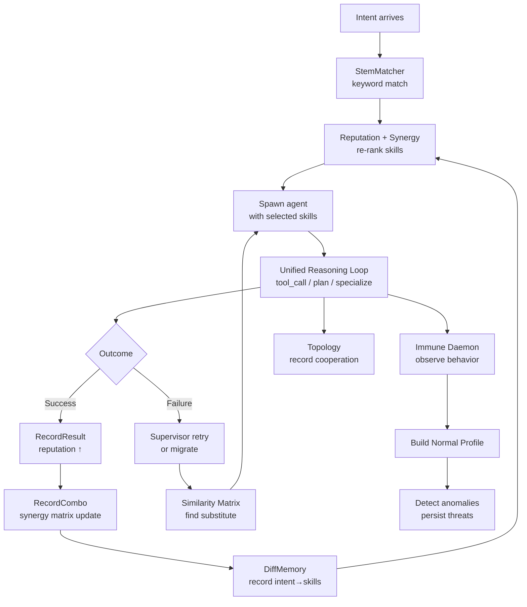

# Intelligence Emergence

Rnix is not just an agent runtime — it is a system designed for **intelligence emergence**. Individual mechanisms (stem cell differentiation, reputation, synergy, immune monitoring, collaboration topology) interact to produce behaviors that no single mechanism could achieve alone.

This document explains the emergent architecture: how simple, local feedback loops combine to create system-level intelligence.

---

## The Emergence Stack

```
┌─────────────────────────────────────────────────┐
│          Emergent Behaviors                     │
│  Natural selection · Memory acceleration        │
│  Neuroplasticity · Self-monitoring              │
├─────────────────────────────────────────────────┤
│          Feedback Loops                         │
│  Reputation → Stem Match re-ranking             │
│  Synergy → Skill combination priority           │
│  Immune → Threat memory accumulation            │
│  Topology → Collaboration pattern telemetry     │
├─────────────────────────────────────────────────┤
│          Core Mechanisms                        │
│  Stem Cell    │ Reputation  │ Synergy Matrix    │
│  Differentiation │ System   │                   │
│  DiffMemory   │ Immune     │ Collaboration      │
│  Lineage      │ Daemon     │ Topology           │
├─────────────────────────────────────────────────┤
│          Foundation                             │
│  Process Model · VFS · Unified Reasoning Loop   │
└─────────────────────────────────────────────────┘
```

Each layer builds on the one below. The foundation provides the process runtime; core mechanisms add specific capabilities; feedback loops connect mechanisms into cycles; emergent behaviors arise from these cycles running over time.

---

## Feature Profiles & Ablation

Feature profiles map directly to the emergence stack layers, enabling controlled ablation experiments. Each profile activates capabilities up to a specific layer:

```
┌─────────────────────────────────────────────────┐
│          Emergent Behaviors                     │  ← full only (immune)
├─────────────────────────────────────────────────┤
│          Feedback Loops                         │  ← adaptive (stem_matcher, diff_memory,
│          Reputation → Stem Match re-ranking     │     specialize, replan, discover_skill)
│          Synergy → Skill combination priority   │
├─────────────────────────────────────────────────┤
│          Core Mechanisms                        │  ← core (planning, spawn, compaction)
├─────────────────────────────────────────────────┤
│          Foundation                             │  ← baseline (VFS + LLM only)
│          Process Model · VFS · Reasoning Loop   │
└─────────────────────────────────────────────────┘
```

| Profile | Stack Layers Active | What It Measures |
|---------|-------------------|------------------|
| `baseline` | Foundation only | Lower bound — raw LLM + VFS device performance |
| `core` | Foundation + Core Mechanisms | Contribution of planning, subprocess spawning, and context compaction |
| `adaptive` | Foundation + Core + Feedback Loops | Contribution of runtime learning, skill acquisition, and path re-planning |
| `full` | All layers | Complete system with immune monitoring (the default) |

### Ablation Evaluation Matrix

A single evaluation run across all four profiles quantifies each layer's incremental value:

```
Task × Profile × Model → Score

Example:
  "Analyze kernel/kernel.go" × baseline × deepseek → 42
  "Analyze kernel/kernel.go" × core     × deepseek → 67  (+25 from planning/spawn)
  "Analyze kernel/kernel.go" × adaptive × deepseek → 81  (+14 from feedback loops)
  "Analyze kernel/kernel.go" × full     × deepseek → 83  (+2 from immune)
```

The delta between adjacent profiles reveals the marginal contribution of each emergence layer. Use `custom` mode for finer-grained experiments — e.g., enabling `diff_memory` alone to isolate memory acceleration from other adaptive mechanisms.

See [Feature Profiles](/guide/configuration#feature-profiles) for configuration details and the preset matrix.

---

## Five Emergent Effects

### 1. Natural Selection

Skill combinations that produce better results are gradually preferred for future tasks.

**Mechanism chain:**
- Agent completes a task → `RecordResult` updates reputation → `RecordCombo` updates synergy matrix
- Next intent arrives → StemMatcher proposes skills → reputation + synergy re-rank the candidates
- High-performing combinations rise; low-performing ones recede

**Guard against lock-in:** An ε-exploration parameter ensures that novel, untested skill combinations still get tried, preventing premature convergence.

### 2. Memory Acceleration

Repeated intents are served faster through differentiation memory.

**Mechanism chain:**
- First encounter: full StemMatcher keyword scan → match → record intent→skills mapping in DiffMemory
- Second encounter: DiffMemory lookup → instant recall, skip matching computation
- DiffMemory persists as JSON Lines files, surviving daemon restarts

**Capacity management:** LRU eviction (by lowest hit count, then oldest timestamp) keeps the memory bounded while retaining the most valuable mappings.

### 3. Neuroplasticity

When an agent fails, the system can reroute tasks through alternative paths.

**Mechanism chain:**
- Supervisor detects persistent failure → restart limit exhausted
- Similarity matrix identifies substitute agents (Jaccard similarity on skill sets)
- Migration is **gated**: only triggers when the substitute demonstrates measurable improvement
- If migration succeeds, the alternative path is reinforced in the collaboration topology

### 4. Passive Immune Learning

The immune system builds behavioral knowledge without interfering with normal operation.

**Mechanism chain:**
- Immune Daemon (enabled by default, warn-only) observes every process
- Behavioral samples accumulate → Normal Profile builds per agent template
- Anomalies detected → `AnomalyAlert` logged + `ThreatSignature` persisted
- Next occurrence of the same pattern → instant recognition (antibody memory)
- Learning period safety: fewer than 5 samples → no detection (avoids false positives on first runs)

### 5. Collaboration Discovery

The system automatically discovers which agent combinations work well together.

**Mechanism chain:**
- Production syscalls feed the topology: `spawn` records parent→child edges, IPC `msg` records peer edges
- Typed cooperation records accumulate: spawn, pipe, message — each tracked separately
- High-frequency paths become visible in `rnix topology` output
- Operational insight: identify bottlenecks, redundant paths, or underutilized agents

---

## The Complete Feedback Diagram



---

## Observability vs. Decision-Making

An important design principle: **not everything that observes also decides**.

| Component | Observes | Decides |
|-----------|----------|---------|
| Lineage | Records differentiation path | No — pure telemetry |
| Collaboration Topology | Records cooperation edges | No — observability tool |
| DiffMemory | Records intent→skills | Yes — accelerates future matching |
| Reputation | Records execution results | Yes — influences skill ranking |
| Synergy Matrix | Records combination outcomes | Yes — boosts proven combinations |
| Immune Daemon | Records behavior patterns | Depends on mode (warn-only vs enforce) |

This separation keeps the system predictable: observability components can never cause unexpected behavior changes, while decision-making components have explicit, testable feedback paths.

---

## Related Documentation

- [Configuration Guide](/guide/configuration#feature-profiles) — Feature profile configuration and preset matrix
- [Autonomous Agents](/guide/autonomous-agents) — Stem cell differentiation and unified reasoning
- [Token Economy & Reputation](/guide/token-economy) — Budget pools, reputation, and synergy
- [Security & Self-Healing](/guide/security) — Immune system and neuroplasticity
- [Monitoring & Supervisor](/guide/monitoring) — Process monitoring and restart strategies
