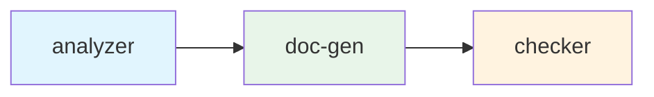

# Compose 编排

通过 YAML 定义多智能体 DAG 工作流。Compose 引擎处理依赖解析、并行调度、结果传递、token 预算池和 SLA 合约。

---

## 快速开始

```yaml
# compose.yaml
version: "1.0"
intent: "Code review workflow"
model: "deepseek-v4-flash"

agents:
  analyzer:
    intent: "Analyze code quality of kernel/kernel.go"
    agent: "code-analyst"
  doc-gen:
    intent: "Generate improvement documentation"
    depends_on:
      analyzer: completed
  checker:
    intent: "Verify analysis quality"
    depends_on:
      doc-gen: completed
```

```bash
$ rnix compose up
compose | Code review workflow | starting
[layer 1/3] analyzer   PID 5 | completed | 3.8s | 1,450 tokens ✓
[layer 2/3] doc-gen    PID 6 | completed | 4.2s | 1,180 tokens ✓
[layer 3/3] checker    PID 7 | completed | 2.5s | 890 tokens ✓
compose | completed | 3/3 agents | 10.5s | 3,520 tokens
```

---

## DAG 调度

引擎自动完成：

1. **解析依赖图** — 从 `depends_on` 构建 DAG
2. **拓扑排序** — 确定执行层次
3. **并行执行** — 同一层的智能体并发运行
4. **结果注入** — 上游输出注入到下游上下文中

```
analyzer ──→ doc-gen ──→ checker      # 线性
    A ←─ C ─→ B                       # C 阻塞两者；C 完成后 A、B 并行
```



---

## Agent 字段

| 字段 | 类型 | 说明 |
|------|------|------|
| `intent` | string | 任务描述 |
| `agent` | string | 命名的 Agent 定义（可选） |
| `model` | string | 模型覆盖 |
| `provider` | string | 提供商覆盖 |
| `depends_on` | map | `<上游>: completed` |
| `timeout` | duration | 执行超时 |
| `max_retries` | int | 失败重试次数 |
| `budget` | int | Token 预算（从池中分配） |
| `priority` | string | `high` / `normal` / `low` |

---

## Token 预算池

为工作流分配共享的 token 预算：

```yaml
budget_pool:
  total: 50000
  allocation: priority    # priority | equal | proportional

agents:
  critical-agent:
    budget: 20000
    priority: high
  helper-agent:
    budget: 5000
    priority: low
```

当多个智能体竞争有限预算时，高优先级智能体优先获得分配。详见 [Token 经济](/zh/guide/token-economy)。

---

## SLA 合约

定义智能体之间的质量期望：

```yaml
agents:
  analyzer:
    intent: "Analyze code"
    contract:
      output_quality: "Must contain at least 3 actionable items"
      max_tokens: 3000
      timeout: 30s
      sla_level: gold
```

执行完成后的 SLA 评估结果会反馈到[声誉系统](/zh/guide/token-economy)。

---

## 结果注入

上游智能体输出自动注入到下游智能体上下文。当智能体 B 依赖智能体 A 时，A 的最终结果作为 tool message 添加到 B 的 system prompt：

```
[上游结果：analyzer]
---
<analyzer 的输出内容>
---
```

这样下游智能体可以在上游结果基础上继续工作，无需手动传递。

## 错误处理

| 场景 | 行为 |
|------|------|
| 智能体失败（退出码 1） | 下游智能体被取消，工作流标记为失败 |
| 智能体超时 | 超过配置的 `timeout` → SIGTERM 终止 |
| 智能体超出预算 | 退出码 2，与失败相同处理 |
| 所有重试耗尽 | 智能体标记为永久失败，下游取消 |

设置 `max_retries` 自动重试失败的智能体：

```yaml
agents:
  flaky-analyzer:
    intent: "分析代码"
    max_retries: 3    # 失败时最多重试 3 次
```

## Compose 文件参考

| 字段 | 类型 | 默认值 | 说明 |
|------|------|--------|------|
| `version` | string | — | Compose 规范版本（`"1.0"`） |
| `intent` | string | — | 工作流描述（显示在 CLI 输出中） |
| `model` | string | — | 所有智能体的默认模型 |
| `budget_pool` | object | — | 共享 token 预算配置 |
| `agents` | map | — | 智能体定义（key = 智能体名称） |

### Budget Pool 字段

| 字段 | 类型 | 默认值 | 说明 |
|------|------|--------|------|
| `total` | int | — | 所有智能体的总 token 预算 |
| `allocation` | string | `priority` | 分配策略：`priority`、`equal` 或 `proportional` |

---

## 命令

```bash
rnix compose up              # 启动工作流
rnix compose up --json       # JSON 输出
rnix compose down            # 停止所有智能体并清理
```

---

## 相关文档

- [AgentShell](/zh/guide/agentshell) — 基于脚本的编排
- [Intent 系统](/zh/guide/intent-system) — 声明式意图分解
- [Token 经济](/zh/guide/token-economy) — 预算池与声誉
- [监控](/zh/guide/monitoring) — rnix top 实时进程视图
