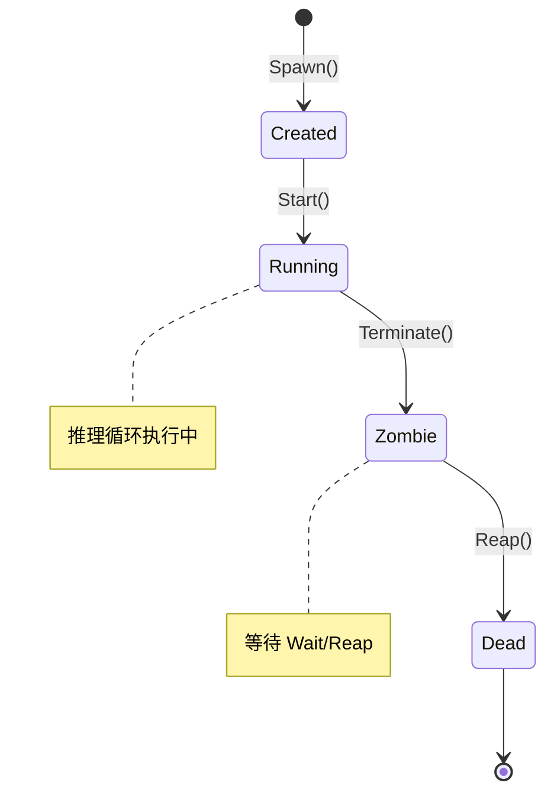

# Rnix 核心概念

Rnix 是一个面向 AI 智能体的操作系统（Agent OS）。它借鉴 Unix 的核心设计哲学——进程、文件系统、系统调用——为 AI 智能体提供统一的运行时环境。在 Rnix 中，每一次智能体执行都是一个进程，每一个外部资源（LLM、文件、Shell）都是一个文件，每一次与内核的交互都是一次系统调用。本文档帮助你建立 Rnix 的核心心智模型。

---

## 1. 进程（Process）

### 定义

进程是 Rnix 的一等计算单元。当你执行 `rnix -i "意图"` 命令时，Rnix 内核会创建一个智能体进程来完成你的意图。每个进程拥有独立的 PID、上下文空间、文件描述符表和调试通道。

Rnix 采用 daemon 架构管理进程：一个后台 daemon 持有唯一的内核实例和进程表，所有 CLI 命令通过 Unix domain socket 与 daemon 通信。daemon 在首次运行 `rnix` 时自动启动，空闲 60 秒后自动退出。你也可以通过 `rnix daemon status` 查看 daemon 状态，或通过 `rnix daemon stop` 手动停止。这种设计使得进程在系统级别可见——在终端 A 启动的进程，可以在终端 B 通过 `rnix ps`/`rnix kill`/`rnix strace` 查看和操作，与 Unix 进程的行为一致。

### Unix 类比

| Rnix 概念 | Unix 对应 | 说明 |
|-----------|----------|------|
| 进程（Process） | Unix 进程 | 一次智能体执行的运行时实例 |
| PID | 进程号 | 全局唯一、递增分配、不回收 |
| 状态机 | 进程状态 | Created → Running → Zombie → Dead |
| Spawn | fork + exec | 创建并启动新进程 |
| Kill | kill(2) 信号 | 向进程发送终止信号（SIGTERM/SIGKILL） |
| Pause/Resume | SIGSTOP/SIGCONT | 暂停/恢复推理循环（SIGPAUSE/SIGRESUME） |
| Wait | waitpid(2) | 等待进程结束并回收资源 |

### 进程生命周期

一个进程从创建到销毁，严格按照以下状态机流转：

```
Created ──→ Running ──→ Zombie ──→ Dead
   │           │           │
   │  Start()  │ Terminate │  Reap()
   │  开始推理  │ 完成/错误  │  Wait 回收
   │           │ /超时/Kill │  资源释放
   │           │           │
   │      SIGPAUSE         │
   │      (循环阻塞)        │
   │           │           │
   │      SIGRESUME        │
   │      (循环恢复)        │
```



**状态说明：**

- **Created（已创建）** — 进程对象已分配，但推理循环尚未开始
- **Running（运行中）** — 推理循环正在执行，智能体正在思考和使用工具。运行中的进程可以通过 SIGPAUSE 暂停——推理循环在下一个 I/O 边界处阻塞直到收到 SIGRESUME，但进程状态仍为 Running（`IsPaused = true`）。
- **Suspended（已暂停）** — （Running 内的逻辑状态）进程通过 SIGPAUSE 暂停。推理循环阻塞，耗时计时器冻结，心跳监控跳过此进程。数据持久化到磁盘。daemon 重启后仍然存活。
- **Zombie（僵尸）** — 推理已结束（正常完成、出错、超时或被 Kill），等待父进程调用 Wait 回收
- **Dead（死亡）** — 所有资源已释放，进程从进程表中移除。**Dead 是冻结状态而非终态**——进程数据持久化在磁盘上（`.rnix/data/steps/<uuid>/`），直到 GC 清理。任何 Dead/Zombie 进程都可以通过 `rnix resume` 恢复。

状态转移在状态机内严格单向，不允许回退（例如不能从 Zombie 回到 Running）。**但请注意**，resume 不是状态转移——它基于历史数据 spawn 一个新进程，保持原有状态机契约不变。

### Resume 设计哲学

Rnix 将 Dead 视为冻结状态而非终态。进程退出后，观测数据保留在磁盘上：

```
.rnix/data/steps/<uuid>/
├── steps.jsonl          # 推理步骤（LLM 请求/响应）
├── events.jsonl         # Syscall 事件
├── ctx-profile.json     # Context heatmap 快照
├── process-meta.json    # System prompt + tool 定义
├── proc-info.json       # 进程元数据
└── checkpoint.json      # 周期性检查点（每 5 步 / 30s）
```

这使以下功能成为可能：

- **`rnix resume <uuid>`** — 继续运行已死亡的进程，保持 UUID 不变
- **`rnix resume --fork <uuid>`** — 从历史节点分叉探索，生成新 UUID
- **Daemon 崩溃恢复** — 暂停的进程在 daemon 重启后自动恢复

详见 [Process Resume](/guide/process-resume) 了解完整的 resume 工作流。

### 示例：完整的进程生命周期

```bash
$ rnix -i "分析代码"
```

这条命令触发以下生命周期：

1. **Spawn** — 内核创建进程（PID 1），分配上下文空间，打开 LLM 设备，状态为 Created
2. **Start** — 推理 goroutine 启动，进程转为 Running
3. **ReasonStep 循环** — 智能体与 LLM 对话，可能调用文件系统或 Shell 等工具
4. **完成** — 智能体产出最终结果，进程转为 Zombie，退出状态写入 Done 通道
5. **Wait/Reap** — CLI 层读取 Done 通道，触发资源释放序列，进程转为 Dead

CLI 输出示例：

```
[kernel] spawning PID 1 (deepseek/deepseek-v4-flash)...
[agent]  step 1/10
[result] 代码分析结果...
[kernel] PID 1 exited(0) | deepseek/deepseek-v4-flash | tokens: 1234 | elapsed: 6.2s
```

### 进程树

每个进程通过 PPID（父进程 PID）记录其父子关系：

- 由 CLI 直接 Spawn 的进程 PPID 为 0（顶层进程）
- 子进程 Spawn 时记录父进程的 PID 作为 PPID
- 父进程退出时，其存活的子进程会被 **reparent**（重新指定父进程）到 PID 0，而非直接终止——这与 Unix 中孤儿进程被 init 进程接管的机制一致

### 进程携带的关键属性

| 属性 | 说明 |
|------|------|
| PID | 全局唯一进程标识符（单调递增，永不回收） |
| UUID | UUID v7 标识符——跨 daemon 重启保持全局唯一，提供时间有序性 |
| PPID | 父进程 PID |
| Intent | 用户意图字符串，创建后不可变 |
| State | 当前状态（Created/Running/Zombie/Dead） |
| IsPaused | 进程是否处于暂停状态（SIGPAUSE 生效，推理循环阻塞） |
| PausedAt | 暂停开始的时间戳；未暂停时为零值 |
| Skills | 进程拥有的 Skill 名称列表 |
| CtxID | 关联的上下文空间标识符 |
| FDTable | 进程打开的文件描述符表 |
| AllowedDevices | 设备权限白名单（由 Skill 聚合而来） |
| DebugChan | 调试事件通道（缓冲 256），供 strace 消费 |
| TokensUsed | 累计 token 消耗量 |
| Provider | 解析后的 LLM 提供商名称（spawn 后不可变） |
| Model | 解析后的模型名称（spawn 后不可变） |

### 进程标识：PID 与 UUID

每个进程有两个标识符：

- **PID** — 单调递增的整数，在单个 daemon 会话内唯一。PID 永不回收。
- **UUID**（UUID v7）— 全局唯一标识符，跨 daemon 重启保持不变。UUID v7 嵌入了时间戳，提供自然的时间排序。步骤记录和追踪数据使用 UUID 存储，实现跨会话连续性。

大多数 CLI 命令使用 PID 引用进程。UUID 用于内部数据持久化和 Dashboard 历史视图。

### 进程历史与持久化

进程退出时，其完整的观测数据会被持久化到磁盘：

- **proc-info.json**：进程元数据快照（PID、UUID、状态、provider、model、tokens、时间戳）
- **steps.jsonl**：所有推理步骤，包含 LLM 请求/响应和工具调用
- **events.jsonl**：完整的 syscall 事件追踪，用于调试
- **ctx-profile.json**：上下文组成 heatmap 快照
- **process-meta.json**：执行期间使用的 system prompt 和 tool 定义
- **checkpoint.json**：周期性检查点（每 5 步 / 30s），用于快速 resume

这些持久化数据支持以下功能：

- **Dashboard 历史浏览** — 查看已死亡进程的详情、时间线和 LLM 对话
- **进程 resume** — 从持久化数据中恢复任何 Dead/Zombie/Suspended 进程
- **跨会话连续性** — UUID v7 在 daemon 重启后仍能标识进程
- **垃圾回收** — 可配置的保留策略（`gc.retention_days` + `gc.max_entries`），清理旧数据

历史数据在 daemon 启动时通过 `LoadHistory()` 加载。Running 和 Suspended 进程永久豁免于 GC 清理。

---

## 2. 虚拟文件系统（VFS）

### 定义

VFS 是 Rnix 的统一抽象层。所有外部资源——LLM 推理引擎、宿主文件系统、Shell 命令执行、进程运行状态——都通过统一的文件路径访问。Rnix 遵循 Unix "一切皆文件"的哲学：你通过 Open 打开一个设备路径获取文件描述符（FD），通过 Read/Write 与设备交互，最后通过 Close 释放资源。

### Unix 类比

| Rnix 概念 | Unix 对应 | 说明 |
|-----------|----------|------|
| VFS | 虚拟文件系统 | 统一的资源访问抽象层 |
| `/dev/` | 设备文件 | LLM、文件系统、Shell 等设备 |
| `/proc/` | procfs | 动态生成的进程运行时信息 |
| FD（文件描述符） | 文件描述符 | 进程内递增整数，从 3 开始分配（0/1/2 预留） |
| DeviceRegistry | 设备驱动注册 | 将 VFS 路径映射到设备工厂 |

### 设备路径表

以下是 Rnix 中所有已注册的 VFS 设备路径：

| VFS 路径 | 用途 | 驱动实现 |
|---------|------|---------|
| `/dev/llm/claude` | LLM 推理设备 | 通过 Claude Code CLI（`claude -p`）调用 |
| `/dev/llm/cursor` | LLM 推理设备 | 通过 Cursor CLI（`agent --print`）调用 |
| `/dev/llm/<provider>` | LLM 推理设备 | OpenAI 兼容 HTTP API（Ollama、Groq、DeepSeek 等） |
| `/dev/fs` | 宿主文件系统访问 | 封装 Go 标准库 `os.Open/Read` |
| `/dev/shell` | Shell 命令执行 | 封装 `exec.CommandContext` |
| `/proc/{pid}/status` | 进程状态（JSON 格式） | ProcFS 动态生成 |
| `/proc/{pid}/intent` | 进程意图（纯文本） | ProcFS 动态生成 |
| `/proc/{pid}/context` | 进程上下文摘要 | ProcFS 动态生成 |

### 示例：推理过程中的 VFS 操作链

当智能体执行推理时，VFS 操作的完整序列如下（步骤 1 和 8 属于进程级操作，步骤 2-7 属于单次推理步骤）：

```
1. Open("/dev/llm/claude", O_RDWR)     → FD(3)        打开 LLM 设备
2. Write(FD(3), <请求 JSON>)            → ok           向 LLM 发送推理请求
3. Read(FD(3), 65536)                   → <响应 JSON>   读取 LLM 响应
4. Open("/dev/fs/./src/main.go", O_RDWR) → FD(4)       智能体请求读取文件（工具调用）
5. Write(FD(4), <读取请求>)              → ok           写入读取参数
6. Read(FD(4), 65536)                   → <文件内容>    获取文件内容
7. Close(FD(4))                         → ok           关闭文件设备
8. Close(FD(3))                         → ok           关闭 LLM 设备
```

### DeviceRegistry：设备发现与前缀匹配

DeviceRegistry 负责将 VFS 路径映射到对应的设备驱动。它支持两种匹配方式：

1. **精确匹配** — 路径与注册路径完全一致（如 `/dev/shell`）
2. **最长前缀匹配** — 路径以注册路径开头（如 `/dev/fs/path/to/file` 匹配 `/dev/fs`，剩余 `/path/to/file` 作为 subpath 传递给驱动）

所有设备驱动统一实现 `VFSFile` 接口：

```
VFSFile 接口：
  Read(length)      — 从设备读取数据
  Write(ctx, data)  — 向设备写入数据（支持 context 取消）
  Close()           — 关闭设备，释放资源
  Stat()            — 获取设备元数据
```

设备注册在 daemon 启动时通过依赖注入完成——daemon 进程初始化 kernel、VFS 和所有驱动，并注册到 DeviceRegistry。CLI 命令作为客户端通过 IPC 与 daemon 通信，不直接接触 kernel 或设备。

---

## 3. Agent 与 Skill

### Agent：我是谁

Agent 定义了一个智能体的身份和角色。它回答"我是谁"这个问题——包括名称、描述、模型偏好、上下文预算，以及引用了哪些 Skill。

Agent 的配置文件为 `agent.yaml`，配合 `instructions.md` 提供角色指令。Agent 存储在 `~/.config/rnix/agents/`（全局）或 `.rnix/agents/`（项目）：

```
agents/code-analyst/
├── agent.yaml        # Agent 配置（身份、模型偏好、Skill 引用）
└── instructions.md   # Agent 角色定义（系统提示词）
```

以 `code-analyst` 为例，其 `agent.yaml` 内容：

```yaml
name: code-analyst
description: "分析代码质量、识别潜在问题并提供改进建议的智能体"
models:
  provider: deepseek  # 或 cursor（可选，通过 --provider CLI flag 覆盖）
  preferred: deepseek-v4-flash
  fallback: deepseek-v4-pro
skills:
  - code-analysis
```

### Skill：如何做 X

Skill 定义了一项具体的程序性知识——它回答"如何做 X"这个问题。Skill 遵循 Agent Skills 行业标准，以 `SKILL.md` 文件表示，包含 YAML frontmatter（元数据 + 工具权限）和 Markdown 正文（操作指南）。Skill 采用四路径模型存储（项目/用户 x native/agents 命名空间），由 `ResolveSkillScopes(cwd)` 解析：

| 路径 | 作用域 | 命名空间 | 优先级 |
|------|--------|----------|--------|
| `<project>/.rnix/skills/` | project | native | 1（最高） |
| `<project>/.agents/skills/` | project | agents | 2 |
| `~/.config/rnix/skills/` | user | native | 3 |
| `~/.agents/skills/` | user | agents | 4（最低） |

解析规则：`project > user`（跨作用域），`native > agents`（同作用域内）。胜出的副本完全覆盖所有被遮蔽的副本。详见 [Skill Packages](/guide/skill-packages) 了解完整的管理模型。

```
skills/code-analysis/
└── SKILL.md          # Skill 定义（Agent Skills 标准格式）
```

以 `code-analysis` 为例，其 `SKILL.md` frontmatter：

```yaml
name: code-analysis
description: >
  Analyze code quality, identify bugs, performance issues and security
  vulnerabilities.
allowed-tools: /dev/fs /dev/shell
```

`allowed-tools` 字段定义了该 Skill 可以访问的 VFS 设备路径——这是 Rnix 的权限模型核心。

### Unix 类比

| Rnix 概念 | Unix 对应 | 说明 |
|-----------|----------|------|
| Agent | 可执行程序（/usr/bin/xxx） | 定义"我是谁"——角色、模型偏好 |
| Skill | 共享库（.so/.dylib） | 定义"如何做 X"——程序性知识、工具权限 |
| Process | 运行时进程实例 | Agent + Skill 组合后的运行时表现 |

就像 Unix 中一个可执行程序链接多个共享库一样，一个 Agent 可以引用多个 Skill。

### 四层能力模型

```
┌──────────────────────────────────────┐
│           Process（运行时实例）         │
│  PID, State, FDTable, DebugChan...  │
├──────────────────────────────────────┤
│           Agent（我是谁）              │
│  name, models, context_budget       │
│  instructions.md → 系统提示词         │
├──────────────────────────────────────┤
│     Skill A          Skill B         │
│  "如何分析代码"     "如何写测试"        │
│  allowed-tools:    allowed-tools:    │
│  /dev/fs           /dev/fs           │
│  /dev/shell        /dev/shell        │
├──────────────────────────────────────┤
│          VFS 设备层（实际能力）          │
│  /dev/fs  /dev/shell  /dev/llm/...  │
└──────────────────────────────────────┘
```

Spawn 时的处理流程：

1. CLI `--agent=code-analyst` → AgentLoader 加载 `agent.yaml` + `instructions.md`
2. AgentLoader 解析 `skills` 列表 → SkillLoader 加载每个 `SKILL.md`
3. `AllowedTools()` 聚合所有 Skill 的 `allowed-tools` → 设置进程的 AllowedDevices 白名单
4. `SystemPrompt()` = Agent instructions + Skill body 拼接 → 作为 LLM 系统提示词

### Agent vs Skill 职责分离

| 维度 | Agent | Skill |
|------|-------|-------|
| 定义 | "我是谁"——身份与角色 | "如何做 X"——程序性知识 |
| 模型偏好 | 有（provider/preferred/fallback） | 无 |
| 上下文预算 | 有（context_budget） | 无 |
| 设备权限 | 无（由 Skill 聚合决定） | 有（allowed-tools） |
| 复用性 | 特定角色 | 跨 Agent 共享 |

### 渐进式加载策略

Rnix 对 Skill 采用渐进式加载，优化资源消耗：

1. **发现阶段** — 仅读取 SKILL.md 的 YAML frontmatter（约 100 tokens），获取名称、描述和工具权限
2. **激活阶段** — 加载完整的 SKILL.md 正文（< 5000 tokens），包含操作指南、工作流等
3. **执行阶段** — 按需加载附属的脚本和资源文件

---

## 4. 系统调用（Syscall）

### 定义

系统调用（Syscall）是智能体与内核交互的唯一接口。就像 Unix 进程通过 syscall 请求内核提供文件 I/O、进程管理等服务一样，Rnix 中的智能体通过 syscall 访问 VFS 设备、管理子进程和操作上下文空间。

### Unix 类比

| Rnix Syscall | Unix 对应 | 说明 |
|-------------|----------|------|
| Spawn | fork + exec | 创建并启动新进程 |
| Kill | kill(2) | 发送信号终止进程 |
| Wait | waitpid(2) | 等待进程结束并回收资源 |
| Open | open(2) | 打开设备路径，获取文件描述符 |
| Read | read(2) | 从文件描述符读取数据 |
| Write | write(2) | 向文件描述符写入数据 |
| Close | close(2) | 关闭文件描述符 |
| Stat | stat(2) | 获取路径元数据 |
| CtxAlloc | mmap/brk | 分配上下文空间 |
| CtxRead | 读内存 | 读取上下文内容 |
| CtxWrite | 写内存 | 写入上下文内容 |
| CtxFree | munmap | 释放上下文空间 |

### MVP Syscall 分类表

Rnix 的内核接口由多个子接口组合而成，共定义 45 个 syscall，涵盖进程管理、上下文、VFS、IPC、信号、能力、监督者和调试等域：

**进程管理（ProcessManager）— 5 个**

| Syscall | 签名概要 | 说明 |
|---------|---------|------|
| Spawn | `Spawn(intent, agent, opts) → PID` | 创建并启动智能体进程 |
| Kill | `Kill(pid, signal) → error` | 向进程发送终止信号 |
| Wait | `Wait(pid) → ExitStatus` | 等待进程结束，回收资源 |
| GetPID | `Process.GetPID() → PID` | 获取当前进程 PID |
| PS | `ListProcs() → []ProcInfo` | 列出所有进程快照 |

**上下文管理（ContextManager）— 4 个**

| Syscall | 签名概要 | 说明 |
|---------|---------|------|
| CtxAlloc | `CtxAlloc(size) → CtxID` | 分配新的上下文空间 |
| CtxRead | `CtxRead(cid, offset, length) → []byte` | 读取上下文内容 |
| CtxWrite | `CtxWrite(cid, offset, data) → error` | 写入上下文内容 |
| CtxFree | `CtxFree(cid) → error` | 释放上下文空间 |

**文件系统（FileSystem）— 5 个**

| Syscall | 签名概要 | 说明 |
|---------|---------|------|
| Open | `Open(pid, path, flags) → FD` | 打开设备路径，分配文件描述符 |
| Read | `Read(pid, fd, length) → []byte` | 从文件描述符读取 |
| Write | `Write(ctx, pid, fd, data) → error` | 向文件描述符写入 |
| Close | `Close(pid, fd) → error` | 关闭文件描述符 |
| Stat | `Stat(path) → FileStat` | 查询路径元数据 |

**调试（Debugger）— 1 个**

| Syscall | 说明 |
|---------|------|
| DebugRecord | 所有 syscall 入口/出口自动记录 SyscallEvent 到 DebugChan（自动机制，非显式调用） |

### 示例：完整进程生命周期中的 Syscall 序列

以 `rnix -i "分析代码" --agent=code-analyst` 为例，从进程创建到销毁的完整 syscall 序列：

```
[  0.000s] Spawn("分析代码", agent="code-analyst")    = PID(1)       12ms
[  0.012s] CtxAlloc(64)                                = CtxID(1)      0ms
[  0.013s] Open("/dev/llm/claude", O_RDWR)             = FD(3)         1ms
[  0.014s] Write(FD(3), <prompt>)                      = ok           5200ms  ← LLM 调用
[  5.214s] Read(FD(3), 65536)                          = <response>     2ms
[  5.216s] Open("/dev/fs/./src/main.go", O_RDWR)      = FD(4)         1ms    ← 工具调用
[  5.217s] Write(FD(4), <tool data>)                   = ok             0ms
[  5.217s] Read(FD(4), 65536)                          = <file content> 1ms
[  5.218s] Close(FD(4))                                = ok             0ms
[  5.218s] CtxWrite(CtxID(1), 0, <tool result>)        = ok             0ms
[  5.219s] Write(FD(3), <prompt+context>)              = ok           3100ms  ← 第二轮推理
[  8.319s] Read(FD(3), 65536)                          = <final text>   2ms
[  8.321s] Close(FD(3))                                = ok             0ms
[  8.321s] CtxFree(CtxID(1))                           = ok             0ms
```

### SyscallError 错误模型

每个 syscall 在出错时返回结构化的 `SyscallError`，包含完整的诊断信息：

| 字段 | 说明 | 示例 |
|------|------|------|
| Syscall | 出错的 syscall 名称 | `"Spawn"`, `"Open"`, `"CtxWrite"` |
| PID | 发起 syscall 的进程 PID | `1` |
| Device | 涉及的 VFS 路径 | `"/dev/llm/claude"` |
| Err | 底层错误 | `"context deadline exceeded"` |
| Code | 分类错误码 | `TIMEOUT`, `NOT_FOUND`, `PERMISSION`, `INTERNAL`, `DRIVER`, `INVALID` |

格式化输出：`[TIMEOUT] PID 1 Spawn: /dev/llm/claude (context deadline exceeded)`

### SyscallEvent 调试追踪

所有 syscall 的入口和出口都会自动记录为 `SyscallEvent`，通过进程的 DebugChan（缓冲 256）传递。当缓冲已满时，新事件会被静默丢弃，不会阻塞 syscall 执行。

每个 SyscallEvent 包含：

| 字段 | 说明 |
|------|------|
| Timestamp | 相对于进程创建时间的偏移量 |
| PID | 进程标识符 |
| Syscall | syscall 名称（与接口方法名一致） |
| Args | 调用参数（键值对） |
| Result | 返回值 |
| Err | 错误信息 |
| Duration | syscall 执行耗时 |

使用 `rnix strace <pid>` 可以实时消费这些事件，类似 Unix 中的 `strace`：

```bash
$ rnix strace 1
[strace] attached to PID 1 (state: running)
[  0.013s] Open("/dev/llm/claude", O_RDWR)  = FD(3)    1ms
[  0.014s] Write(FD(3), 1234 bytes)          = ok      5200ms
[  5.214s] Read(FD(3), 65536)                = 892B      2ms
...
[strace] detached from PID 1 (process exited)
```

---

## 5. 概念关系总览

### 调用链架构图

```
用户 / CLI（客户端模式）
    │
    │  Unix Domain Socket（IPC）
    ▼
┌──────────────────────────────────────────┐
│          Daemon（后台进程）                 │
│                                          │
│  ┌────────────────────────────────────┐  │
│  │          IPC Server                │  │
│  │  接收请求 → 路由 → 流式响应          │  │
│  └───────────────┬────────────────────┘  │
│                  │                       │
│  ┌───────────────▼────────────────────┐  │
│  │          Kernel（内核）              │  │
│  │  ProcessManager + ContextManager   │  │
│  │  + FileSystem + Debugger           │  │
│  │                                    │  │
│  │  ┌─────────┐    ┌──────────────┐   │  │
│  │  │ Process  │───→│ reasonStep() │   │  │
│  │  │ 进程表    │    │ 推理循环      │   │  │
│  │  └─────────┘    └──────┬───────┘   │  │
│  │                        │ Syscall   │  │
│  │                        ▼           │  │
│  │  ┌────────────────────────────┐    │  │
│  │  │        VFS（虚拟文件系统）    │    │  │
│  │  │  Open / Read / Write / Close │   │  │
│  │  └─────────────┬──────────────┘    │  │
│  │                │ DeviceRegistry    │  │
│  │                ▼                   │  │
│  │  ┌──────┬──────┬───────┬───────┐   │  │
│  │  │/dev/ │/dev/ │/dev/  │/proc/ │   │  │
│  │  │llm/  │fs    │shell  │{pid}/ │   │  │
│  │  │claude│      │       │status │   │  │
│  │  └──┬───┴──┬───┴───┬───┴───┬───┘   │  │
│  └─────┼──────┼───────┼───────┼───────┘  │
└────────┼──────┼───────┼───────┼──────────┘
         ▼      ▼       ▼       ▼
      Claude  宿主     Shell   进程
      Code   文件系统  命令执行  运行状态
      CLI
```

daemon 是一个隐藏的后台进程（`rnix daemon --internal`），在首次执行 `rnix` 命令时自动启动。所有 CLI 操作（spawn、ps、kill、strace）都是客户端请求，通过 Unix domain socket 发送给 daemon 中的 IPC Server，由 Server 路由到 kernel 执行。这种架构使得多个终端可以共享同一个内核的进程表。

IPC Server 采用**请求循环连接模型**：单个连接上可以发送多次非流式请求（Ping、ListProcs、Kill），服务端处理后继续等待下一个请求。流式方法（Spawn、AttachDebug）会在 handler 内部管理连接生命周期，流结束后关闭连接。这意味着 `EnsureDaemon()` 的 Ping 探活和后续 Spawn 请求可以共用同一个连接，避免 broken pipe 错误。

### 端到端数据流

以 `rnix -i "分析代码" --agent=code-analyst` 为例，完整的请求路径：

```
用户输入: rnix -i "分析代码" --agent=code-analyst
    │
    ▼
cmd/rnix/main.go（CLI 客户端）
    │  1. 解析 --agent flag
    │  2. EnsureDaemon() — 检测/启动 daemon（Ping 探活复用同一连接）
    │  3. ipc.Client.Dial(socketPath) — 连接 daemon
    │  4. Client.SpawnAndWatch() — 在同一连接上发送 Spawn 请求
    │
    │         Unix Domain Socket
    ▼
┌─── daemon（IPC Server）────────────────────┐
│                                            │
│  接收 SpawnRequest                          │
│    │                                       │
│    ▼                                       │
│  AgentLoader.Load("code-analyst")          │
│    │  → 读取 agents/code-analyst/          │
│    │  → 解析 skills → SkillLoader          │
│    │  → 聚合 AllowedTools, SystemPrompt    │
│    ▼                                       │
│  kernel.Spawn(intent, agentInfo, opts)     │
│    │  1. CtxAlloc → 分配上下文空间          │
│    │  2. SetSystemPrompt                   │
│    │  3. AppendMessage(user, "分析代码")    │
│    │  4. Open("/dev/llm/claude") → FD(3)   │
│    │  5. 启动 goroutine → reasonStep 循环   │
│    ▼                                       │
│  reasonStep 循环:                           │
│    │  BuildPrompt → Write → Read → 解析    │
│    │  ├── ActionText → 最终结果             │
│    │  └── ActionToolCall → 工具调用          │
│    ▼                                       │
│  进程完成 → callbackMux 路由事件到客户端     │
│    │  StreamEvent 流式推送                  │
│    │                                       │
│  流结束 → kern.Reap(pid)                    │
│    │  关闭 DebugChan → CtxFree → Dead      │
└────┼───────────────────────────────────────┘
     │  Unix Domain Socket（流式 StreamEvent）
     ▼
CLI 客户端接收 ProgressEvent → 格式化输出:
    [kernel] spawning PID 1 (deepseek/deepseek-v4-flash)...
    [agent/1] reasoning step 1...
    ══ Result ══...
    [kernel] PID 1 exited(0) | deepseek/deepseek-v4-flash | tokens: 1234 | elapsed: 6.2s
```

关键区别：CLI 不再直接调用 kernel，而是作为 IPC 客户端将请求发送给 daemon。daemon 中的 `callbackMux` 将每个进程的进度事件路由到对应的客户端连接，实现流式输出。Spawn 流式结束后，IPC Server 主动调用 `kernel.Reap(pid)` 清理 Zombie 进程（关闭 DebugChan、释放上下文、移除进程表），因为 daemon 模式下没有 CLI 端的 `Wait()` 调用来触发回收。

### strace 调试数据流

`strace` 命令通过 IPC 跨终端消费进程的 DebugChan 实现 syscall 追踪。你可以在任意终端对任意正在运行的进程执行 `rnix strace <pid>`，无需在启动进程的终端中操作：

```
daemon 内部:
  syscall 入口 → NewEvent() → 构造 SyscallEvent（填充 Timestamp/PID/Syscall/Args）
      │
      ▼
  syscall 执行
      │
      ▼
  syscall 出口 → CompleteEvent() → 填充 Result/Err/Duration
      │
      ▼
  EmitEvent(proc.DebugChan, event)  [非阻塞，缓冲满则丢弃]
      │
      ▼
  IPC Server handleAttachDebug → 读取 DebugChan → 序列化为 StreamEvent
      │
      │  Unix Domain Socket（流式 SyscallEvent）
      ▼
任意终端:
  rnix strace <pid> → IPC Client.AttachDebug → 接收 StreamEvent → 格式化输出
      格式: [N.NNNs] SyscallName(args) → result    duration
```
