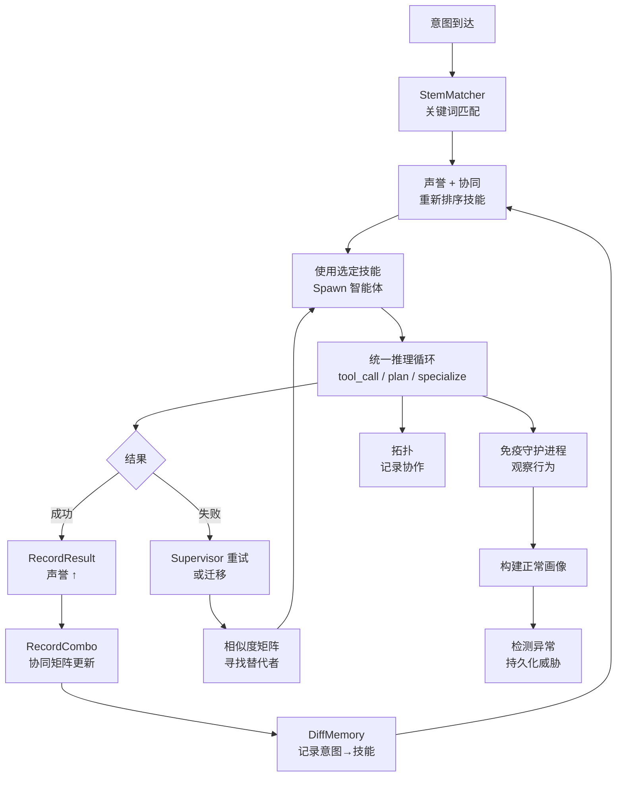

# 智能涌现

Rnix 不仅是一个智能体运行时——它是一个为**智能涌现**而设计的系统。各个独立机制（干细胞分化、声誉、协同、免疫监控、协作拓扑）相互作用，产生任何单一机制都无法独立实现的行为。

本文档阐述涌现架构：简单的局部反馈闭环如何组合产生系统级智能。

---

## 涌现堆栈

```
┌─────────────────────────────────────────────────┐
│          涌现行为                               │
│  自然选择 · 记忆加速                            │
│  神经可塑性 · 自我监控                          │
├─────────────────────────────────────────────────┤
│          反馈闭环                               │
│  声誉 → 干细胞匹配重排序                        │
│  协同 → 技能组合优先级                           │
│  免疫 → 威胁记忆积累                             │
│  拓扑 → 协作模式遥测                             │
├─────────────────────────────────────────────────┤
│          核心机制                               │
│  干细胞分化  │ 声誉系统  │ 协同矩阵             │
│  分化记忆    │ 免疫守护  │ 协作拓扑             │
│  谱系追踪    │ 进程      │                      │
├─────────────────────────────────────────────────┤
│          基础设施                               │
│  进程模型 · VFS · 统一推理循环                  │
└─────────────────────────────────────────────────┘
```

每一层都建立在下面一层之上。基础设施提供进程运行时；核心机制添加特定能力；反馈闭环将各机制连接成循环；涌现行为从这些循环的长期运行中产生。

---

## 特性档案与消融

特性档案直接映射到涌现堆栈的各层，支持受控的消融实验。每个档案激活到特定层的能力：

```
┌─────────────────────────────────────────────────┐
│          涌现行为                               │  ← 仅 full（免疫）
├─────────────────────────────────────────────────┤
│          反馈闭环                               │  ← adaptive（stem_matcher、diff_memory、
│          声誉 → 干细胞匹配重排序                 │     specialize、replan、discover_skill）
│          协同 → 技能组合优先级                    │
├─────────────────────────────────────────────────┤
│          核心机制                               │  ← core（planning、spawn、compaction）
├─────────────────────────────────────────────────┤
│          基础设施                               │  ← baseline（仅 VFS + LLM）
│          进程模型 · VFS · 统一推理循环           │
└─────────────────────────────────────────────────┘
```

| 档案 | 激活的堆栈层 | 衡量内容 |
|------|-------------|----------|
| `baseline` | 仅基础设施 | 下界——裸 LLM + VFS 设备性能 |
| `core` | 基础设施 + 核心机制 | 规划、子进程派生和上下文压缩的贡献 |
| `adaptive` | 基础设施 + 核心 + 反馈闭环 | 运行时学习、技能获取和路径重规划的贡献 |
| `full` | 所有层 | 包含免疫监控的完整系统（默认） |

### 消融评估矩阵

一次跨全部四个档案的评估即可量化每层的增量价值：

```
Task × Profile × Model → Score

示例：
  "Analyze kernel/kernel.go" × baseline × deepseek → 42
  "Analyze kernel/kernel.go" × core     × deepseek → 67  (+25 来自规划/子进程)
  "Analyze kernel/kernel.go" × adaptive × deepseek → 81  (+14 来自反馈闭环)
  "Analyze kernel/kernel.go" × full     × deepseek → 83  (+2 来自免疫)
```

相邻档案之间的差值揭示了每个涌现层的边际贡献。使用 `custom` 模式进行更精细的实验——例如，仅启用 `diff_memory` 以将记忆加速从其他自适应机制中隔离出来。

配置详情和预设矩阵参见[特性档案](/zh/guide/configuration#特性档案-feature-profile-)。

---

## 五大涌现效应

### 1. 自然选择

产生更好结果的技能组合逐渐成为未来任务的首选。

**机制链：**
- 智能体完成任务 → `RecordResult` 更新声誉 → `RecordCombo` 更新协同矩阵
- 新意图到达 → StemMatcher 提出候选技能 → 声誉 + 协同重新排序候选者
- 高表现组合上升；低表现组合退后

**防止锁定：** ε-探索参数确保新颖的、未经测试的技能组合仍有机会被尝试，防止过早收敛。

### 2. 记忆加速

重复出现的意图通过分化记忆获得更快的服务。

**机制链：**
- 首次遇到：完整的 StemMatcher 关键词扫描 → 匹配 → 在 DiffMemory 中记录意图→技能映射
- 再次遇到：DiffMemory 查找 → 即时召回，跳过匹配计算
- DiffMemory 以追加写入的 JSON Lines 文件持久化，可跨 daemon 重启保留

**持久化细节：**
- 每个学习到的映射在记录时（写锁内）立即追加到 `diffmemory.jsonl`
- daemon 启动时，文件被重放到内存映射中（重复意图以最后写入为准）
- 损坏的行被跳过并输出警告——启动永远不会因部分损坏而失败
- 命中次数跨重启持久化，保留长期积累的声誉信号

**过时验证：** 查找时，当前可用技能数与存储的 `available_count` 进行比较。如果不一致（技能被添加或删除），缓存的映射被视为未命中，强制执行全新的 StemMatcher 扫描以生成最新映射。

**容量管理：** LRU 驱逐策略（按最低命中次数，再按最旧时间戳）在保持内存边界的同时保留最有价值的映射。

### 3. 神经可塑性

当智能体失败时，系统可以通过替代路径重新路由任务。

**机制链：**
- Supervisor 检测到持续性失败 → 重启次数耗尽
- 相似度矩阵识别替代智能体（基于技能集的 Jaccard 相似度）
- 迁移受**门控约束**：只有当替代者表现出可测量的改善时才触发
- 如果迁移成功，替代路径在协作拓扑中被强化

### 4. 被动免疫学习

免疫系统在不干扰正常运行的情况下积累行为知识。

**机制链：**
- 免疫守护进程（默认启用，观测模式）观察每个进程
- 行为样本积累 → 为每个 Agent 模板构建正常行为画像
- 检测到异常 → 记录 `AnomalyAlert` + 持久化 `ThreatSignature`
- 相同模式再次出现 → 即时识别（抗体记忆）
- 学习期安全：少于 5 个样本 → 不检测（避免首次运行的误报）

### 5. 协作发现

系统自动发现哪些智能体组合协作效果好。

**机制链：**
- 生产级 syscall 填充拓扑：`spawn` 记录父→子边，IPC `msg` 记录对等通信边
- 类型化协作记录积累：spawn、pipe、message——各自独立追踪
- 高频路径在 `rnix topology` 输出中可见
- 运维洞察：识别瓶颈、冗余路径或利用不足的智能体

---

## 完整反馈图



---

## 观测性 vs. 决策

一个重要的设计原则：**并非所有观测者都参与决策**。

| 组件 | 观测 | 决策 |
|------|------|------|
| 谱系追踪 | 记录分化路径 | 否——纯遥测 |
| 协作拓扑 | 记录协作边 | 否——可观测性工具 |
| 分化记忆 | 记录意图→技能 | 是——加速未来匹配 |
| 声誉系统 | 记录执行结果 | 是——影响技能排名 |
| 协同矩阵 | 记录组合结果 | 是——提升经验证的组合 |
| 免疫守护进程 | 记录行为模式 | 取决于模式（观测 vs 执行） |

这种分离保持了系统的可预测性：观测性组件永远不会导致意外的行为变化，而决策组件具有明确的、可测试的反馈路径。

---

## 相关文档

- [配置指南](/zh/guide/configuration#特性档案-feature-profile-) — 特性档案配置与预设矩阵
- [自主智能体](/zh/guide/autonomous-agents) — 干细胞分化与统一推理
- [Token 经济与声誉](/zh/guide/token-economy) — 预算池、声誉与协同
- [安全与自愈](/zh/guide/security) — 免疫系统与神经可塑性
- [监控与 Supervisor](/zh/guide/monitoring) — 进程监控与重启策略
